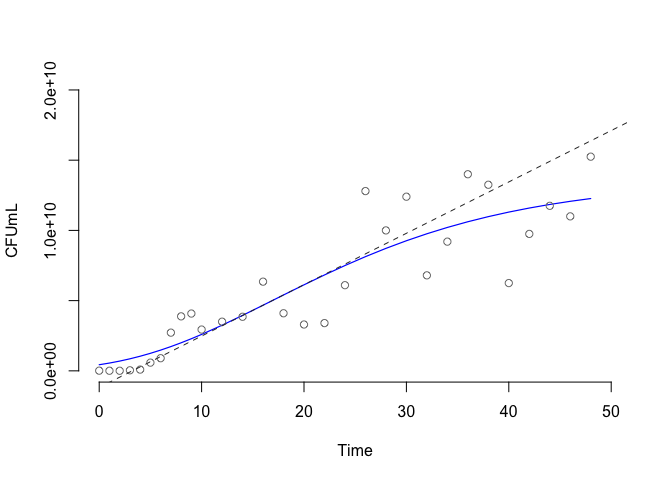
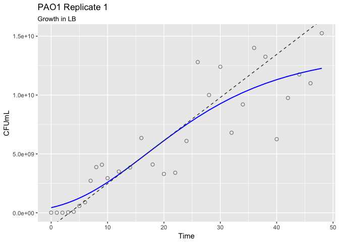
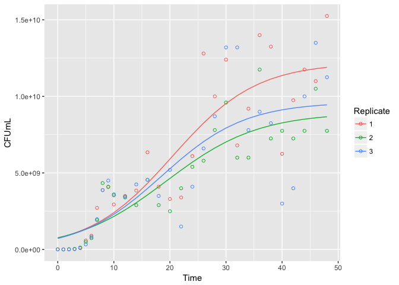

<!-- README.md is generated from README.Rmd. Please edit that file -->
growthcurve: Analysis of Biological Growth
==========================================

[](http://www.repostatus.org/#active) [](https://opensource.org/licenses/BSD-2-Clause) [](https://travis-ci.org/briandconnelly/growthcurve) [](https://cran.r-project.org/package=growthcurve)

The growthcurve package provides tools for analyzing biological growth, or "growth curves" in R. It is designed to integrate into modern workflows based around ["tidy data"](https://www.jstatsoft.org/article/view/v059i10), allowing it to be used in conjunction with other tools. growthcurve also provides wrappers that allow tidy growth data to be analyzed using the popular, but no-longer-maintained [grofit](https://cran.r-project.org/package=grofit) package, if installed.

Installation
------------

growthcurve is not quite ready to be available on [CRAN](http://cran.r-project.org), but you can use [devtools](http://cran.r-project.org/web/packages/devtools/index.html) to install the current development version:

``` r
    if(!require("devtools")) install.packages("devtools")
    devtools::install_github("briandconnelly/growthcurve", build_vignettes = TRUE)
```

Fitting Growth Curves
---------------------

growthcurve's most important function is `fit_growth`, which fits a growth curve to the given data. Here, we'll fit a growth curve to one replicate population from the included `pseudomonas` data set, which has columns `Time` and `CFUmL`:

``` r
library(dplyr)
library(growthcurve)

rep1 <- filter(pseudomonas, Replicate == 1 & Strain == "PAO1")
myfit <- fit_growth(rep1, Time, CFUmL)
```

Even better, we can do this all at once with pipes:

``` r
myfit <- pseudomonas %>%
    filter(Replicate == 1 & Strain == "PAO1") %>%
    fit_growth(Time, CFUmL)
```

By default, `fit_growth` will fit a logistic curve, however the `model` argument can be used to specify a different model type. Here, we'll use a Gompertz function:

``` r
library(dplyr)
library(growthcurve)

rep1 <- filter(pseudomonas, Replicate == 1 & Strain == "PAO1")
myfit <- fit_growth(rep1, Time, CFUmL, model = "gompertz")
```

Other options include `logistic4p`, `linear`, `loess`, and `spline`. Additionally, `grofit_logistic`, `grofit_gompertz`, `grofit_gompertz.exp`, `grofit_richards`, and `grofit_spline` can be used to provide compatability with legacy scripts that use [grofit](https://cran.r-project.org/package=grofit). There's also a `grofit_parametric`, which finds the best among grofit's parametric models.

Interpreting Results
--------------------

*coming soon!*

Visualizing Growth Curves
-------------------------

growthcurve includes tools for visualizing growth curves using either R's base graphics or [ggplot2](https://cran.r-project.org/web/packages/ggplot2/index.html).

``` r
plot(myfit, show_raw = TRUE, show_maxrate = TRUE, show_asymptote = FALSE)
```



``` r
library(ggplot2)

autoplot(myfit, title = "PAO1 Replicate 1", subtitle = "Growth in LB")
```



Alternatively, we can add growth curves to a ggplot2 plot with `stat_growthcurve`:

``` r
pao1data <- filter(pseudomonas, Strain == "PAO1")
ggplot(data = pao1data, aes(x = Time, y = CFUmL, color = Replicate)) +
    geom_point(shape = 1) +
    stat_growthcurve()
```



Code of Conduct
---------------

This project is released with a [Contributor Code of Conduct](CONDUCT.md). By participating in this project, you agree to abide by its terms.

License
-------

growthcurve is released under the [Simplified BSD License](https://opensource.org/licenses/BSD-2-Clause).
